# SHOT-VAE: Semi-supervised Deep Generative Models With Label-aware ELBO Approximations

Here is the official implementation of the model `SHOT-VAE` in paper ["SHOT-VAE: Semi-supervised Deep Generative Models
With Label-aware ELBO Approximations"]().

## Model Review

* **Smooth-ELBO**

	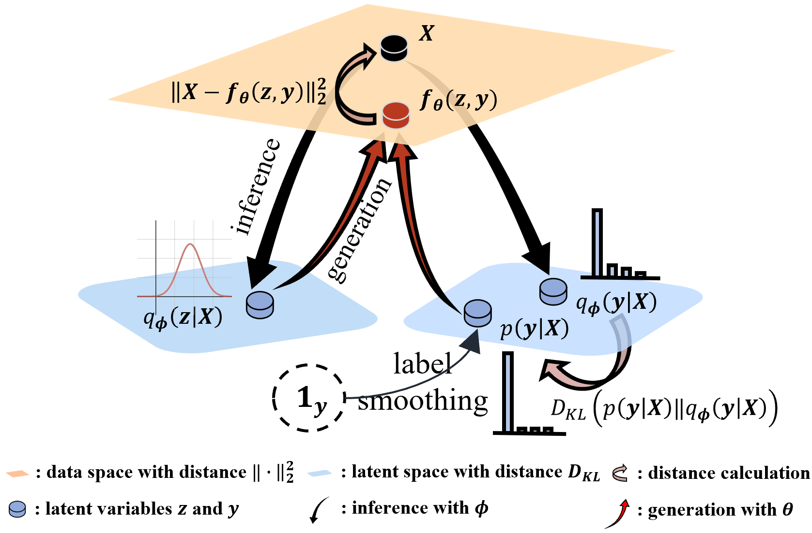

* **Optimal Interpolation**

	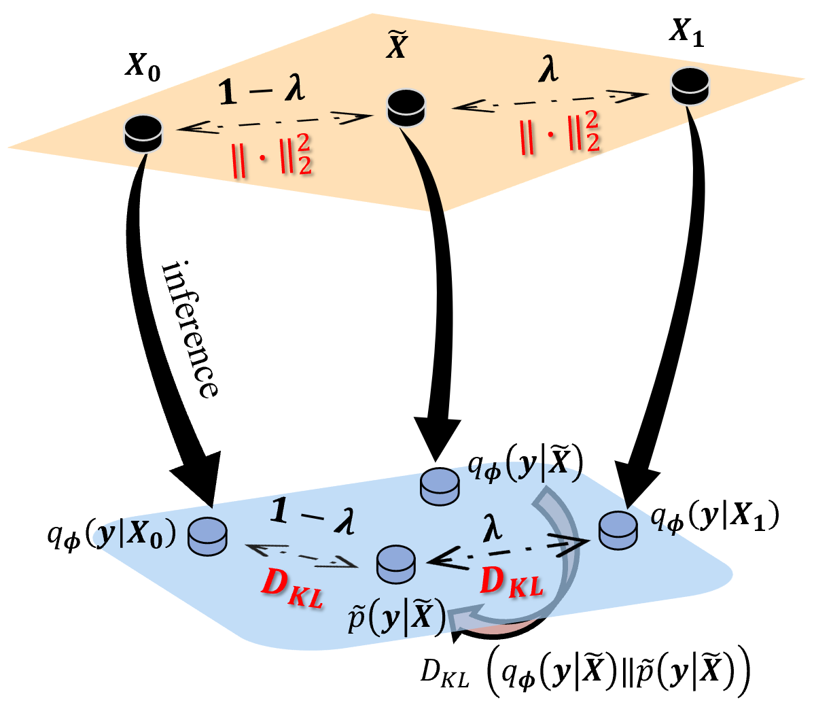

# Setup

### Install Package Dependencies

```
Python Environment: >= 3.6
torch = 1.2.0
torchvision = 0.4.0
scikit-learn >= 0.2
tensorbard >= 2.0.0
```

### Install Datasets

We need users to declare a `base path` to store the dataset as well as the log of training procedure. The  *directory structure* should be

```yaml
base_path
│       
└───dataset
│   │   cifar
│       │   cifar-10-batches-py
│       │   |	...
│       │   cifar-100-python
│       │   |	...
│   │   svhn
│       │   ...
│   │   mnist
│       │   ...
└───trained_model_1
│   │	parmater
│   │	runs
└───trained_model_2
│   │	parmater
│   │	runs
...
└───trained_model_n
│   │	parmater
│   │	runs
```

We refer users to use the following functions in `torchvision` to install datasets

```shell
from os import path
import torch
import torchvision
# set base_path
base_path = "./"
# install mnist,svhn,cifar10,cifar100
torchvision.datasets.MNIST(path.join(base_path,"dataset","mnist"),download=True)
torchvision.datasets.CIFAR10(path.join(base_path,"dataset","cifar"),download=True)
torchvision.datasets.CIFAR100(path.join(base_path,"dataset","cifar"),download=True)
torchvision.datasets.SVHN(path.join(base_path,"dataset","cifar"),download=True)
```

Or you can manually put the dataset in the appropriate folder.

## Running

Notice that we have implemented 3 categories of backbones: **WideResNet, PreActResNet and Densenet**. Here we give the example for **WideResNet**. To use other network backbone, please change `--net-name` parameter (e.g. `--net-name preactresnet18`).

For **CUDA computation**, please set the `--gpu` parameter (e.g. `--gpu "0,1"` means to use gpu0 and gpu1 together to do calculation).

### Semi-supervised Learning

#### SHOT-VAE in Cifar10 (4k) and Cifar100 (4k and 10k) 

Here we list several important parameters **need to be set manually** in the following table

| Parameter       | Means                                                        |
| --------------- | ------------------------------------------------------------ |
| br              | If we use BCE loss in $E_{p,q}\log p(X\vert z,y)$, default is False. |
| annotated_ratio | The annotated ratio for dataset.                             |
| ad              | The milestone list for adjust learning rate.                 |
| epochs          | The total epochs in training process                         |

1. For Cifar10 (4k), please use the following command

   ```shell
   # for wideresnet-28-2
   python main_shot_vae.py -bp basepath --net-name wideresnet-28-2 --gpu gpuid --br
   # for wideresnet-28-10
   python main_shot_vae.py -bp basepath --net-name wideresnet-28-10 --gpu gpuid --br
   ```

2. For Cifar100 (4k), please use the following command

   ```shell
   # for wideresnet-28-2
   python main_shot_vae.py -bp basepath --net-name wideresnet-28-2 --gpu gpuid --dataset "Cifar100" --annotated-ratio 0.1 -ad [500,600,650] --epochs 700 --br
   # for wideresnet-28-10
   python main_shot_vae.py -bp basepath --net-name wideresnet-28-10 --gpu gpuid --dataset "Cifar100" --annotated-ratio 0.1 -ad [500,600,650] --epochs 700
   ```

3. For Cifar100 (10k), please use the following command

   ```shell
   # for wideresnet-28-2
   python main_shot_vae.py -bp basepath --net-name wideresnet-28-2 --gpu gpuid --dataset "Cifar100" --annotated-ratio 0.25 -ad [500,600,650] --epochs 700 --br
   # for wideresnet-28-10
   python main_shot_vae.py -bp basepath --net-name wideresnet-28-10 --gpu gpuid --dataset "Cifar100" --annotated-ratio 0.25 -ad [500,600,650] --epochs 700
   ```

*The performance of test dataset in training process for different dataset is listed as:*

* **Cifar10 (4k)**

  * *WideResNet-28-2*

  * 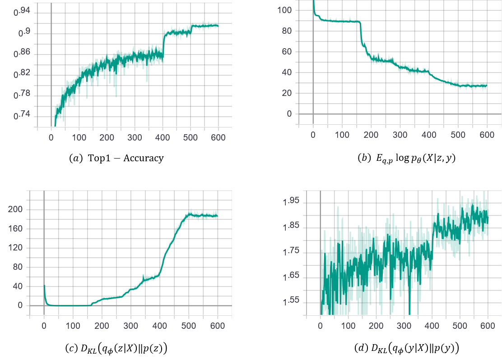

  * *WideResNet-28-10*

    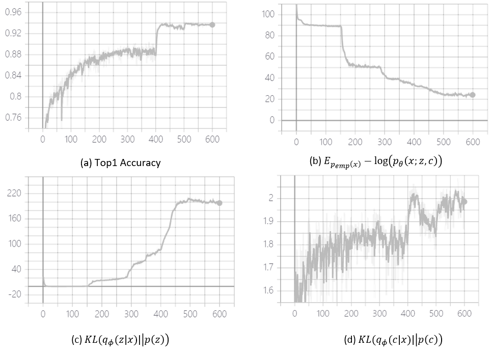

* **Cifar100 (4k)**
	
  * *WideResNet-28-2*

	  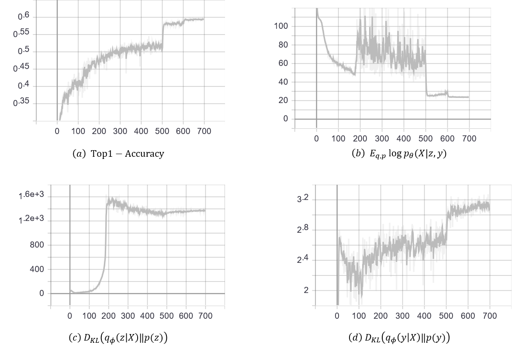
	
	* *WideResNet-28-10*
	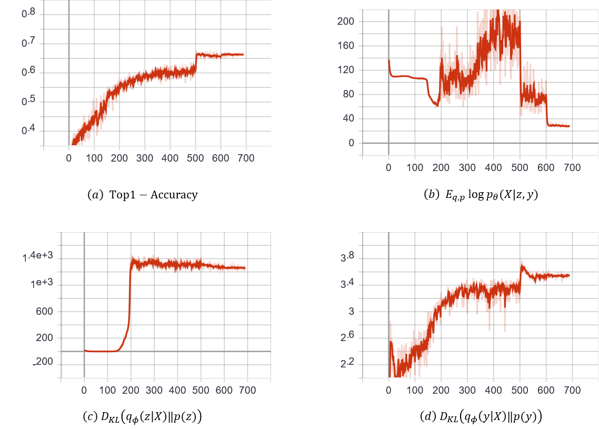
	
* **Cifar100 (10k)**

  * *WideResNet-28-2*

    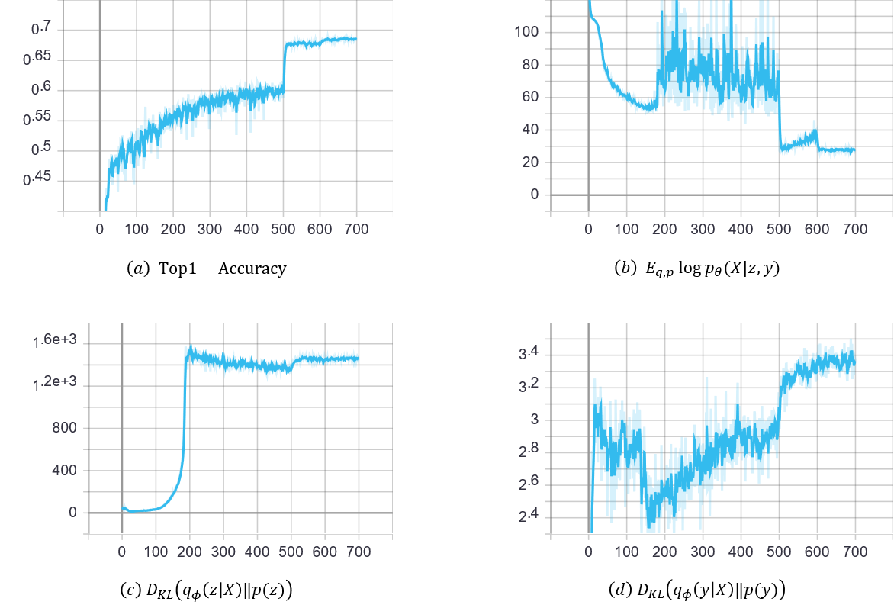

  * *WideResNet-28-10*

	  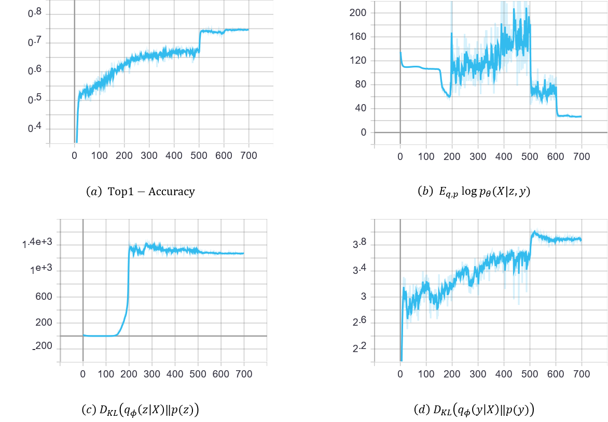

#### M2-VAE in Cifar10 (4k) and Cifar100 (4k and 10k)
1. For Cifar10 (4k), please use the following command

   ```shell
   # for wideresnet-28-2
   python main_M2_vae.py -bp basepath --net-name wideresnet-28-2 --gpu gpuid --br
   # for wideresnet-28-10
   python main_M2_vae.py -bp basepath --net-name wideresnet-28-10 --gpu gpuid --br
   ```

2. For Cifar100 (4k), please use the following command

   ```shell
   # for wideresnet-28-2
   python main_M2_vae.py -bp basepath --net-name wideresnet-28-2 --gpu gpuid --dataset "Cifar100" --annotated-ratio 0.1 -ad [500,600,650] --epochs 700 --br
   # for wideresnet-28-10
   python main_M2_vae.py -bp basepath --net-name wideresnet-28-10 --gpu gpuid --dataset "Cifar100" --annotated-ratio 0.1 -ad [500,600,650] --epochs 700
   ```

3. For Cifar100 (10k), please use the following command

   ```shell
   # for wideresnet-28-2
   python main_M2_vae.py -bp basepath --net-name wideresnet-28-2 --gpu gpuid --dataset "Cifar100" --annotated-ratio 0.25 -ad [500,600,650] --epochs 700 --br
   # for wideresnet-28-10
   python main_M2_vae.py -bp basepath --net-name wideresnet-28-10 --gpu gpuid --dataset "Cifar100" --annotated-ratio 0.25 -ad [500,600,650] --epochs 700
   ```
#### Only classifier in Cifar10 (4k) and Cifar100 (4k and 10k) 
1. For Cifar10 (4k), please use the following command

   ```shell
   # for wideresnet-28-2
   python main_classifier_vae.py -bp basepath --net-name wideresnet-28-2 --gpu gpuid
   # for wideresnet-28-10
   python main_classifier_vae.py -bp basepath --net-name wideresnet-28-10 --gpu gpuid 
   ```

2. For Cifar100 (4k), please use the following command

   ```shell
   # for wideresnet-28-2
   python main_classifier_vae.py -bp basepath --net-name wideresnet-28-2 --gpu gpuid --dataset "Cifar100" --annotated-ratio 0.1 
   # for wideresnet-28-10
   python main_classifier_vae.py -bp basepath --net-name wideresnet-28-10 --gpu gpuid --dataset "Cifar100" --annotated-ratio 0.1 
   ```

3. For Cifar100 (10k), please use the following command

   ```shell
   # for wideresnet-28-2
   python main_classifier_vae.py -bp basepath --net-name wideresnet-28-2 --gpu gpuid --dataset "Cifar100" --annotated-ratio 0.25
   # for wideresnet-28-10
   python main_classifier_vae.py -bp basepath --net-name wideresnet-28-2 --gpu gpuid --dataset "Cifar100" --annotated-ratio 0.25
   ```
#### Smooth-ELBO VAE in MNIST (100) and SVHN (1k) [Table.1]
Use the following commands to reproduce our results
```
# run Smooth-ELBO VAE on MNIST (100)
python main_smooth_ELBO_mnist.py -bp basepath --gpu gpuid

# run One-stage SSL VAE on SVHN (1k)
python main_smooth_ELBO_svhn.py -bp basepath --gpu gpuid
```


### Generative Performance [Table.5]

* **Generated Examples of SHOT-VAE**

  * *MNIST*

    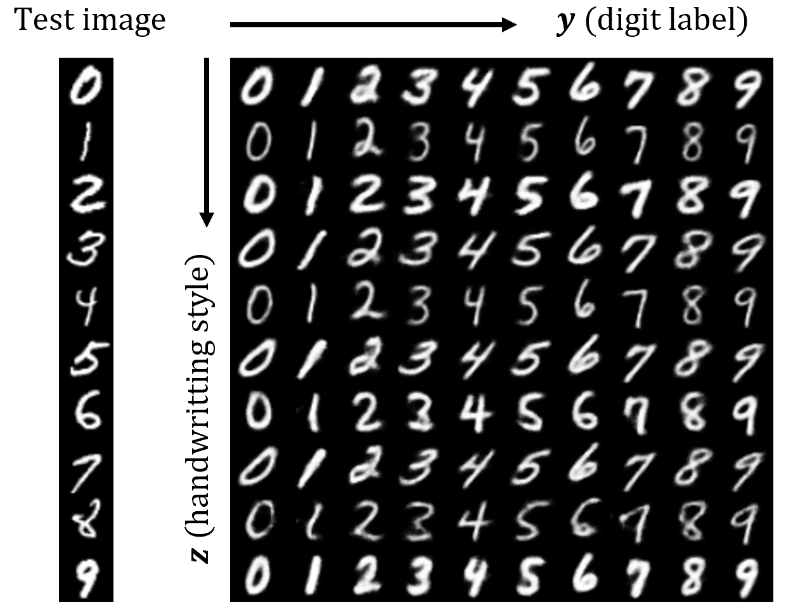

  * *SVHN*

    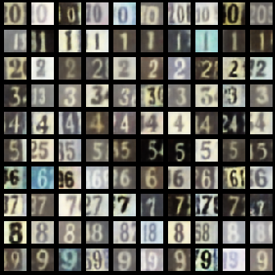

  * *Cifar10*

    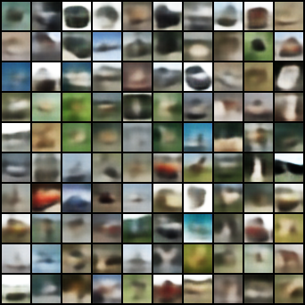

  * *Cifar100*

    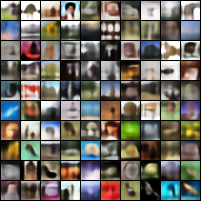

